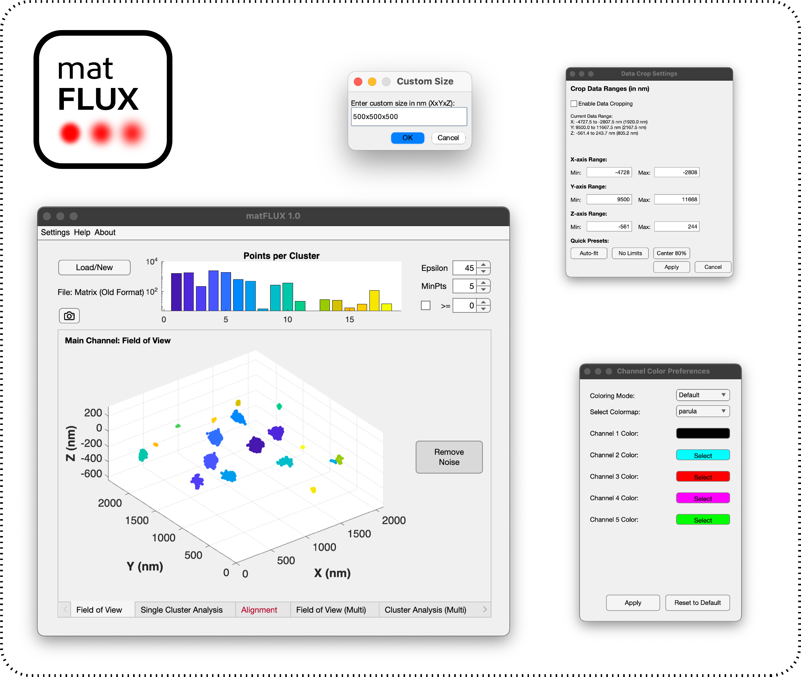

# matFLUX 1.0

**matFLUX** is a MATLAB-based application designed for the analysis of isotropic **3D MINFLUX localization microscopy** data.  
It provides tools for clustering, multi-channel alignment, radial distribution, and precision analysis of nanoscale structures in a user-friendly GUI.

Kräusslich Lab, CIID Heidelberg, Germany.

 <!-- Optional: Add a screenshot -->

---

## 🔬 Features

- Field of View visualization with DBSCAN clustering
- Single cluster inspection with ellipsoid/alpha-shape fitting
- Multichannel alignment using bead data or manual correction
- Line profile and radial distribution analysis
- Cluster statistics, trace quality, and localization precision
- Export to `.mat`, `.tif`, and high-resolution figures
- Crop and Color adjustments

---

## 📦 Installation

### Option 1: Standalone App (No MATLAB Required)

1. Download the standalone installer for your OS (Mac/Windows/Linux).
2. Follow the instructions to install MATLAB Runtime (R2020a or newer).
3. Launch matFLUX from the installed app.

### Option 2: MATLAB App (.mlapp)

Requirements:

- MATLAB R2018b or later (App Designer required)
- Toolboxes:
  - Statistics and Machine Learning Toolbox
  - Image Processing Toolbox

Usage:

1. Launch `matFLUX.mlappinstall`.
2. Run 'matFLUX.mlapp' inside MATLAB.
3. Click **Run** to start the app.

---

## ⚙️ Python Dependency (Alignment Feature)

If you want to use automatic alignment based on bead data:

- Install Python 3.x and ensure it's on your system PATH.
- Required script: `resources/zarr_extract.py`
- Bead data must be exported in ZARR format from the Abberior MINFLUX system.
- If not directly detected, you can link the zarr script from within the app.

---

## 📁 File Formats

- Input: `.mat` files exported from Abberior MINFLUX software
- Output: `.mat`, `.tif`, `.png`, `.pdf`

---

## 📖 Documentation

The full user tutorial is available in the app under the **Help** menu or as a standalone PDF in `/docs/matFLUX_Tutorial.pdf`.

---

## 📄 License

This project is licensed under the [MIT License](LICENSE).

---

## 📢 Citation

If you use matFLUX in your research, please cite it:

```bibtex 
@software{hacke2025matflux,
  author       = {Moritz Hacke},
  title        = {matFLUX: A MATLAB application for 3D MINFLUX data analysis},
  version      = {1.0},
  year         = {2025},
  url          = {https://github.com/yourusername/matFLUX},
  note         = {MIT License}
}
```


## 🤝 Contributing

Pull requests, bug reports, and feature suggestions are welcome.  
Please use the [Issues](https://github.com/mhke0/matFLUX/issues) tab to report problems or request features.

---

## 🧠 Acknowledgments

- Abberior Instruments for their support in MINFLUX data export
- MATLAB App Designer and open-source scientific computing tools
- Scientific Software Center Heidelberg
